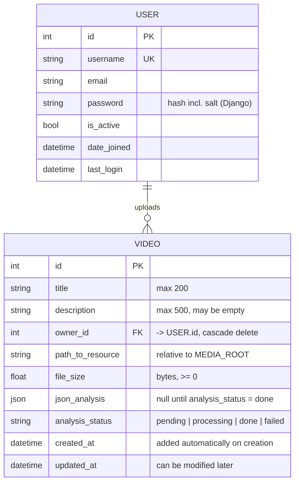

```mermaid
erDiagram
    USER ||--o{ VIDEO : uploads

    USER {
        int id PK
        string username UK
        string email
        string password "hash incl. salt (Django)"
        bool is_active
        datetime date_joined
        datetime last_login
    }
    VIDEO {
        int id PK
        string title "max 200"
        string description "max 500, may be empty"
        int owner_id FK "-> USER.id, cascade delete"
        string path_to_resource "relative to MEDIA_ROOT"
        float file_size "bytes, >= 0"
        json json_analysis "null until analysis_status = done"
        string analysis_status "pending | processing | done | failed"
        datetime created_at "added automatically on creation"
        datetime updated_at "can be modified later"
    }
```