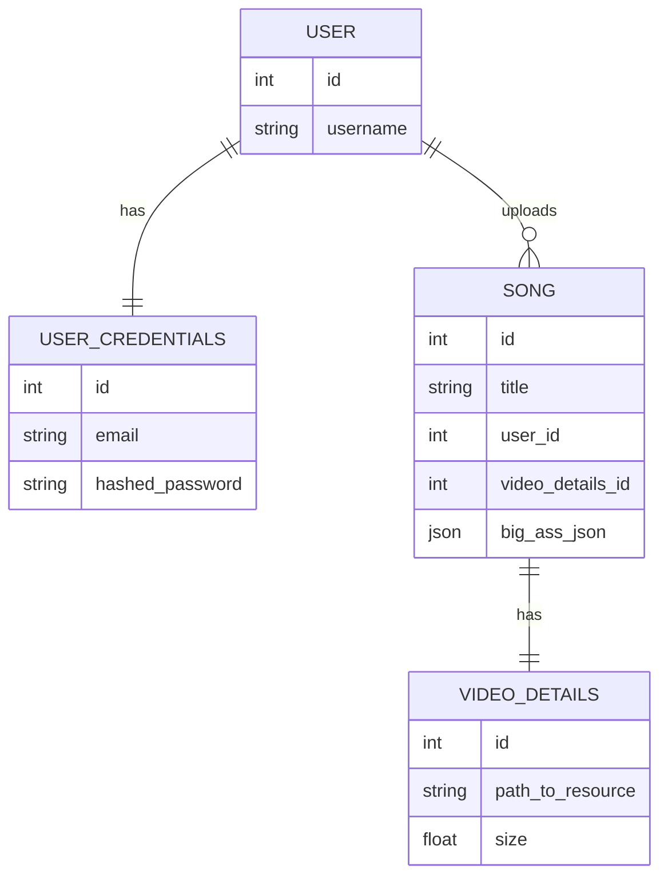

```mermaid
erDiagram
    USER ||--|| USER_CREDENTIALS : has
    USER ||--o{ SONG : uploads
    SONG ||--|| VIDEO_DETAILS : has

    USER {
        int id
        string username
    }
    USER_CREDENTIALS {
        int id
        string email
        string hashed_password
    }
    VIDEO_DETAILS {
        int id
        string path_to_resource
        float size
    }
    SONG {
        int id
        string title
        int user_id
        int video_details_id
        json big_ass_json
    }
```